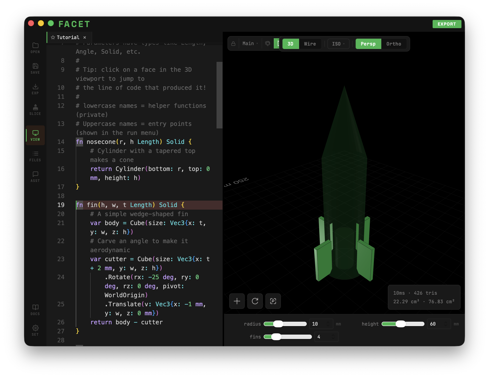
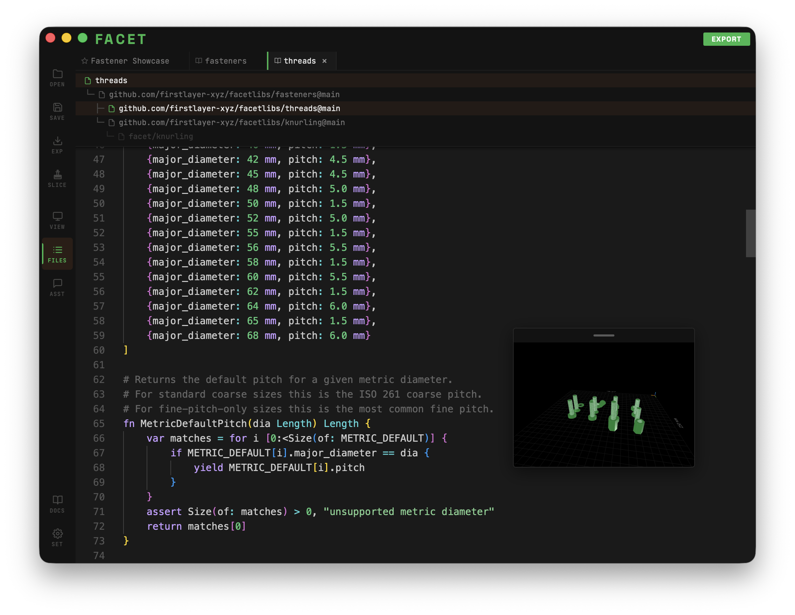
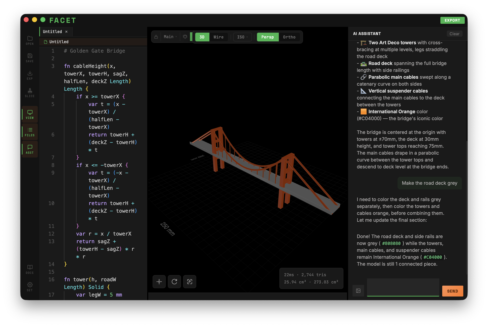

# Facet

Facet is a code-driven CAD application. You write code, Facet renders the 3D model in real time. Click a face in the viewport to jump to the line that created it.

The language is purpose-built for CAD: it has physical units (mm, in, deg), boolean operations (`+`, `-`), and interactive parameter sliders that let you tweak your design without editing code.



## What It Looks Like

```
fn Main(
    radius Length = 8 mm where [2:20] mm,
    height Length = 30 mm where [10:60] mm,
    fins   Number = 4 where [2:8],
) {
    var body = Cylinder(bottom: radius, top: radius, height: height)
    var nose = Cylinder(bottom: radius, top: 0 mm, height: height * 0.4)
        .Translate(v: Vec3{x: 0 mm, y: 0 mm, z: height})
    var fin = Cube(size: Vec3{x: 1 mm, y: radius * 1.5, z: height * 0.3})
        .Translate(v: Vec3{x: -0.5 mm, y: radius, z: 0 mm})
    return body + nose + fin.CircularPattern(count: fins)
}
```

Parameters with `where` clauses become sliders in the UI. Change `fins` from 4 to 6 and the model updates instantly.

## Features

- **Live preview** -- edit code, see the result immediately
- **Physical units** -- `mm`, `in`, `deg`, `rad` are first-class types
- **Boolean operations** -- `+` (union), `-` (difference), `*` (intersection)
- **Interactive sliders** -- constrained parameters become UI controls
- **2D sketches** -- draw profiles and extrude, revolve, loft, or sweep them
- **Libraries** -- import community packages with `var T = lib "github.com/..."`


- **Face-click navigation** -- click a face in the 3D viewport to jump to the source
- **Debug stepping** -- step through operations one at a time to see how your model is built
- **Export** -- STL, OBJ, 3MF, GLB
- **Slicer integration** -- send directly to BambuStudio, OrcaSlicer, PrusaSlicer, or Cura
- **AI assistant** -- built-in chat panel that can read and edit your code (supports Claude, Ollama, and others)



## Getting Started

Download the latest release from [Releases](https://github.com/firstlayer-xyz/Facet/releases), or [build from source](BUILDING.md).

The app opens with a tutorial that walks you through the language basics by building a toy rocket.

## Language Overview

Functions starting with a capital letter are entry points -- they appear in the run menu:

```
fn Main() {
    return Cube(size: Vec3{x: 10 mm, y: 10 mm, z: 10 mm})
}
```

Lowercase functions are helpers:

```
fn rounded_box(w, d, h, r Length) Solid {
    return Cube(size: Vec3{x: w, y: d, z: h})
        .Fillet(radius: r)
}
```

### Primitives

```
Cube(size: Vec3{x: 10 mm, y: 20 mm, z: 5 mm})
Sphere(radius: 8 mm)
Cylinder(bottom: 5 mm, top: 5 mm, height: 20 mm)
```

### Transforms

```
solid.Translate(v: Vec3{x: 10 mm, y: 0 mm, z: 0 mm})
solid.RotateZ(angle: 45 deg, pivot: WorldOrigin)
solid.Mirror(normal: Vec3{x: 1 mm, y: 0 mm, z: 0 mm})
solid.Scale(factor: 2.0)
```

### Patterns

```
solid.LinearPattern(count: 5, spacing: Vec3{x: 12 mm})
solid.CircularPattern(count: 8)
```

### 2D Sketches

```
var profile = Circle(radius: 10 mm) - Circle(radius: 8 mm)
var ring = profile.Extrude(height: 5 mm)
```

Full language reference is available in the built-in docs panel (Help > Documentation).

## CLI

Facet includes a command-line compiler for batch processing:

```bash
facetc model.fct -o model.3mf
facetc model.fct -o model.stl -entry Bracket -set radius=12 -set height=30
facetc model.fct -fmt          # format source
facetc model.fct -fmt -w       # format in place
```

## License

See [LICENSE](LICENSE).
